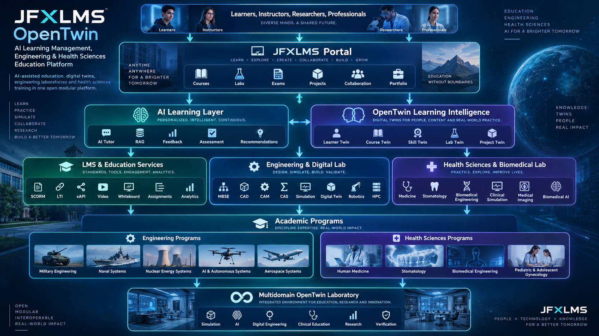
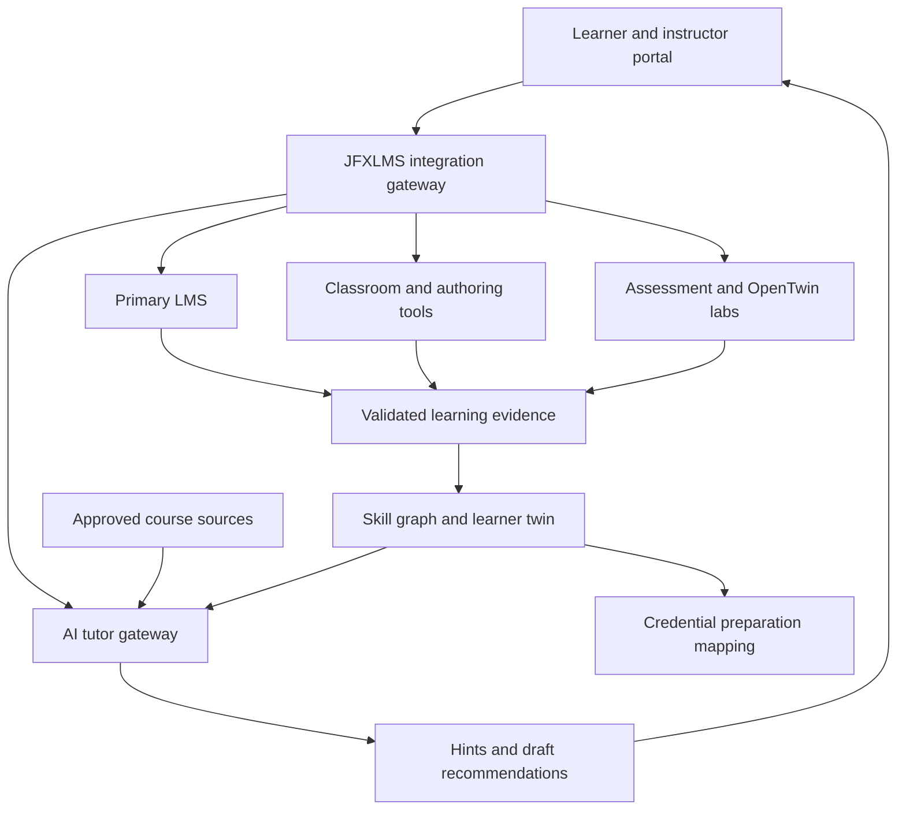

<p align="center">
  
</p>

<p align="center">
  <em>
    OpenTwin architecture for AI-assisted learning, engineering education,
    simulation, digital twins, Microsoft certification pathways,
    LinkedIn Learning, NPTEL and professional skills development.
  </em>
</p>

# JFXLMS — OpenTwin AI Learning Integration Architecture

An open-source-first architecture for adaptive learning, collaborative classrooms, STEM authoring, programming assessment and simulation-based skill evidence. This extension connects the categorized software compendium to the existing OpenTwin laboratories, learner skill model and professional-certification proposal below.

**Status:** proposed architecture and dependency catalog; no new integrations are implemented by this documentation change. Source review: 2026-09-20. Native API, LTI, SCORM, identity and event support must be verified for each selected release. Listing a project does not establish interoperability, production readiness or a common license.

**Navigation:** [Integration architecture](#integration-architecture) · [Categorized compendium](#categorized-compendium) · [AI and digital twins](#ai-and-learning-digital-twins) · [Delivery roadmap](#delivery-roadmap-and-acceptance) · [Existing certification architecture](#microsoft-certification-linkedin-learning--nptel-simulation-integration-architecture)

## Integration architecture

Choose **one authoritative LMS per deployment**. Other LMS products are alternative backends or explicitly scoped federation peers, not simultaneous masters of enrollment, grades and completion. JFXLMS supplies the integration gateway, learning-resource registry, AI orchestration and OpenTwin evidence model.



| Layer | Responsibility | Candidate integration |
|---|---|---|
| Experience | Course navigation, accessible activities, instructor review | JFXLMS portal; optional Liferay portal shell |
| Identity and authorization | Tenant, course membership, learner/instructor roles | Existing identity provider and qualified per-product SSO adapters |
| LMS system of record | Enrollment, course versions, gradebook and completion | Frappe Learning, OpenOlat, Forma LMS, CourseLit, Sakai, Canvas or Odoo eLearning |
| Learning resources | Draft/review/publish lifecycle and reusable assets | eXeLearning 3, Adapt, OCW Management System, Presenton, ocp-reveal |
| Live classroom | Sessions, participant permissions, recording references | BigBlueButton or a custom OpenVidu application |
| Spatial and mathematical interaction | Annotations, equation input, rendering and interactive exercises | PenEcho, OpenBoard, MathQuill, MathJax; qualified GeoGebra deployment |
| Assessment and labs | Reproducible exercises, feedback and simulation evidence | Artemis, Interactive OpenMP Programming, existing OpenTwin lab gateway |
| AI services | Retrieval, tutoring, hints, authoring assistance and model routing | OpenTutor adapter, optional mathematics model such as Llemma, qualified datasets |
| Evidence and analytics | Validated events, provenance, learner-visible progress | Proposed evidence service, skill graph and learner twin |
| Professional pathways | Provider metadata and objective mapping | Existing Microsoft Learn, LinkedIn Learning and NPTEL proposal |

Keep application databases separate. Exchange stable identifiers and versioned API/event contracts instead of cross-writing product tables. Course ownership, authoritative grades and conflict resolution must be defined before enabling bidirectional synchronization.

### Interoperability boundaries

| Mechanism | Proposed use | Boundary and verification |
|---|---|---|
| LTI 1.3 | Launch external learning tools with scoped course/user context | Verify both platform and tool profiles, registration, deployment IDs and authentication; optional Advantage services need separate capability checks |
| SCORM | Run packaged learning activities against a compatible LMS runtime | Distinguish SCORM 1.2 and 2004; verify completion, score, resume and commit behavior |
| xAPI | Send validated learning-activity statements to a selected LRS | Select the version and vocabulary; internal events require mapping and validation |
| Product APIs | Enrollment metadata, course assets, session creation, assessment exchange | Use documented endpoints, supported editions and least-privilege credentials |
| Files and exports | Slides, board snapshots, authoring sources and migration outputs | Preserve format/version, source license, checksums and loss reports |
| MCP | Bounded AI access to approved resources, boards and lab metadata | MCP is not an LMS interoperability or identity standard; authorize every tool operation |
| Webhooks/events | Asynchronous evidence and progress updates | Signed or authenticated delivery, event IDs, replay protection, retries and deduplication |

[LTI 1.3 specification](https://www.imsglobal.org/spec/lti/v1p3/) and [xAPI specification repository](https://github.com/adlnet/xAPI-Spec) are reference sources for the selected adapters. Standards support is a per-product, per-version qualification item; this proposal does not claim universal conformance.

The simplified xAPI-like JSON in the earlier certification section illustrates domain intent, not a conformant wire statement. The adapter must emit the complete required actor, verb and object structures and validate them against the selected xAPI version.

## Categorized compendium

The tables distinguish proposed JFXLMS roles from upstream capabilities. Linked repositories and documentation are source references. Pin a release/commit and inspect its actual license and dependencies before implementation.

### 1. LMS backends and enterprise learning portals

| Project and source | Proposed role | Integration boundary |
|---|---|---|
| [Frappe Learning](https://github.com/frappe/lms) | Course, chapter, lesson, quiz and assignment backend for a compact deployment | Qualify Frappe framework dependencies and supported APIs; a documented Zoom feature does not imply a built-in BigBlueButton adapter |
| [OpenOlat](https://github.com/OpenOLAT/OpenOLAT) | Institutional courses, assessment and communication | Verify release-specific identity, content and external-tool support |
| [Forma LMS](https://github.com/formalms/formalms) | Organizational training and course administration alternative | Pin compatible PHP/database versions and qualify course/reporting interfaces |
| [CourseLit](https://github.com/codelitdev/courselit) / [product documentation entry](https://courselit.app/) | Course publishing, memberships and optional learning commerce | Distinguish self-hosted features from hosted-plan capabilities; check API/SSO availability for the chosen deployment |
| [Sakai](https://github.com/sakaiproject/sakai) | Institutional teaching, research and collaboration backend | Pin a supported release rather than copying historical quick-start runtime versions |
| [Canvas LMS](https://github.com/instructure/canvas-lms) | Course delivery and gradebook backend | AGPLv3 upstream source; hosted services and external integrations have separate configuration/terms |
| [Odoo eLearning](https://github.com/odoo/odoo/tree/master/addons/website_slides) | Learning connected to an Odoo business environment | Qualify the website_slides module, dependencies and Community/Enterprise boundary of any added modules |
| [Liferay Portal / DXP source](https://github.com/liferay/liferay-portal) | Optional portal and enterprise navigation shell | Not the authoritative gradebook by default; use the applicable open-source licensing option and verify module terms in [LICENSING.md](https://github.com/liferay/liferay-portal/blob/master/LICENSING.md) |

Select a backend through a small compatibility exercise covering course creation, enrollment, an external activity, score persistence and learner export. Do not install all seven LMS backends merely to cover the catalog.

### 2. Live classrooms and collaborative workspaces

| Project and source | Proposed role | Integration boundary |
|---|---|---|
| [BigBlueButton](https://github.com/bigbluebutton/bigbluebutton) | Teacher-led virtual classroom with audio/video, presentation, whiteboard and breakout workflows | Session creation/join and recording references through a server-side adapter; attendance is not proof of mastery |
| [OpenVidu](https://github.com/openvidu/openvidu) | WebRTC foundation for custom tutoring and collaboration applications | Alternative to a ready-made classroom; qualify the selected release architecture, edition, recording, TURN and infrastructure requirements |
| [PenEcho](https://github.com/penecho/penecho) | Shared spatial context combining handwriting, diagrams, equations and AI conversation | Use supported MCP/asset interfaces after capability checks; retained board snapshots and AI-readable annotations need course access controls |
| [OpenBoard](https://github.com/OpenBoard-org/OpenBoard) | Desktop interactive whiteboard for instructor work and classroom assets | Start with exported artifacts or screen sharing; do not assume a native multi-user web API |

Recordings, transcripts, board captures and chat are separate data classes with explicit retention and sharing controls. An opted-in transcript can become a reviewed course resource; ingestion into RAG or model training is not automatic.

### 3. Authoring, open courseware and presentation generation

| Project and source | Proposed role | Integration boundary |
|---|---|---|
| [eXeLearning 3](https://github.com/exelearning/exelearning) | Create and publish reusable educational resources | AGPLv3 tool; verify export formats for the selected version and retain editable sources alongside published packages |
| [Adapt framework](https://github.com/adaptlearning/adapt_framework) | Responsive HTML5 learning modules | Framework and authoring tool are distinct components; plugins and tracking support require compatibility checks |
| [OCW Management System](https://github.com/SumonMSelim/ocwms) | Course-material, assignment and faculty/student workflow reference | Candidate identified by the supplied description; qualify API/export support and individual course-content rights |
| [Presenton](https://github.com/presenton/presenton) | AI-assisted presentation drafts and exports | Teacher reviews facts, citations, mathematical notation, images and accessibility before publication; hosted or local model choice is deployment-specific |
| [ocp-reveal](https://github.com/OCamlPro/ocp-reveal) | OCaml-generated reveal.js HTML presentations | Qualify OCaml/dune/js_of_ocaml dependencies and browser compatibility; not a course player or grading service |

Use a content lifecycle of draft, reviewed, published, superseded and withdrawn. Store the source artifact, exported artifact, content version, license, reviewer and competency tags. AI-generated content remains a draft until reviewed.

### 4. Mathematics interfaces and STEM representations

| Project and source | Proposed role | Integration boundary |
|---|---|---|
| [GeoGebra](https://github.com/geogebra/geogebra) | Interactive geometry, algebra, statistics and calculus exercises | Assess the exact component and distribution under the [official license terms](https://www.geogebra.org/license); source code and bundled product materials have different terms |
| [MathQuill](https://github.com/mathquill/mathquill) | Structured browser formula entry | Preserve editable expressions and a keyboard/text alternative; not a symbolic solver |
| [MathJax](https://github.com/mathjax/MathJax) | Display of mathematical notation in lessons, hints and assessments | Rendering does not establish mathematical correctness; configure supported inputs and accessible output |

For equations, retain source notation, rendered view and exercise context. For handwritten work, retain the original image/strokes and mark machine recognition as a candidate transcription that can be corrected. An LLM explanation, a mathematical renderer and a verified calculation serve different roles.

GeoGebra's source-code license does not make every installer, language asset or hosted service unrestricted free software. Keep it optional in a strictly free-software deployment until the selected packaging is qualified.

### 5. Adaptive tutoring, mathematics models and training datasets

| Project and source | Proposed role | Integration boundary |
|---|---|---|
| [OpenTutor](https://github.com/zijinz456/OpenTutor) | Local-first, block-based adaptive workspace connected to approved course materials | This is the project matching the supplied description, not other projects sharing the OpenTutor name; validate model configuration and evidence exchange |
| [Llemma](https://github.com/EleutherAI/math-lm) | Optional mathematics-model research baseline and tutor component | Check model-weight, base-model, code and data terms separately; mathematical outputs require evaluation and tool-backed checks |
| [SwallowCode](https://github.com/rioyokotalab/swallow-code-math) | Optional code-data research for domain adaptation | Dataset release and provenance must be pinned; the reviewed dataset terms reference the Llama 3.3 Community License and upstream data obligations |
| [SwallowMath](https://github.com/rioyokotalab/swallow-code-math) | Optional mathematical-reasoning data research | Same separate dataset qualification; not automatically a permissively licensed course bank or a held-out benchmark |

SwallowCode and SwallowMath are datasets, not inference engines. Their “openly licensed” description must not be interpreted as an OSI-approved software license or unrestricted redistribution. Llemma is not automatically instruction-tuned for classroom tutoring. Neither inclusion establishes improved learning outcomes.

### 6. Programming, HPC and interactive assessment

| Project and source | Proposed role | Integration boundary |
|---|---|---|
| [Artemis](https://github.com/ls1intum/Artemis) | Programming, quiz, modeling and other exercises with individual feedback | Preserve assessment ownership and rubric versions; qualify CI runners and supported LMS interfaces |
| [Interactive OpenMP Programming](https://github.com/passlab/InteractiveOpenMPProgramming) / [author paper](https://arxiv.org/abs/2409.09296) | Interactive parallel-programming curriculum and reproducible laboratory scenarios | The work combines LLM-assisted authoring with human revision; it is a learning resource, not a general-purpose tutor or grading engine |

An OpenMP lab should store compiler/runtime versions, input size, CPU allocation, thread count, schedule, correctness checks and timing methodology. Evaluate correctness before speedup. Execute learner and generated code in isolated, quota-limited workers without production credentials.

### 7. SCORM integration and course migration

| Project and source | Proposed role | Integration boundary |
|---|---|---|
| [React-scorm-provider (RSP)](https://github.com/S4-NetQuest/react-scorm-provider) | SCORM API communication inside a React learning activity | A wrapper for runtime calls, initially oriented to single-SCO/simple communication; not an LMS runtime, package builder or universal iframe player |
| [moodle2edx](https://github.com/mitocw/moodle2edx) | Offline migration reference from Moodle backup to edX XML | Upstream explicitly marks it unsupported; quiz conversion is partial. Use an isolated migration experiment and report unsupported content |

Migration must produce a mapping report: source IDs, destination IDs, missing assets, broken links, unsupported activities, quiz/rubric differences and manual corrections. Validate against the selected Open edX import version; do not imply transfer of enrollments, grades, attempts or certificates from content conversion alone.

## AI and learning digital twins

Extend the existing learner twin with evidence-backed competency estimates, source versions and uncertainty. It represents a learning history and a revisable skill model, not a definitive psychological profile.

### AI service boundaries

| Service | Input → output | Review/evaluation |
|---|---|---|
| Course RAG | Authorized, versioned resources → cited explanations | Retrieval permission filters; citation correctness; abstain when evidence is insufficient |
| Adaptive tutor | Exercise, learner-selected goal and approved evidence → hints and next activity | Compare with an instructor-authored baseline; learner can correct the model |
| Spatial reasoning assistant | Approved board region and context → diagram/explanation draft | Retain original strokes and region references; confirm transcription before grading |
| Mathematics assistant | Expression/problem → candidate solution and check requests | Check with a suitable symbolic/numerical/formal tool when available; distinguish checked steps from generated prose |
| Authoring assistant | Instructor brief and sources → lesson, quiz or slide draft | Editorial review and accessibility check before publishing |
| Programming feedback | Submission plus deterministic test results → explanation | Tests/rubrics determine assessed behavior; AI suggestions cannot overwrite results |
| Learning-path planner | Skill gaps and resource metadata → proposed route | Explain prerequisites, time assumptions and credential-source freshness |
| Analytics assistant | Aggregated evidence → instructor summaries | Protect individual records; no automatic high-stakes learner decisions |

A local-first model gateway should permit changing the inference runtime/model without changing the LMS. Record provider, model revision, prompt template, retrieval sources and evaluation configuration. Hosted inference is optional and must follow the deployment's data-sharing policy.

### Bounded agent and MCP workflow

Proposed tools include course-resource search, current-activity lookup, learner-authorized skill-gap retrieval, board-region reading, draft-hint generation and isolated lab launch. Each tool needs tenant/course scope and an explicit schema. These names describe proposed interfaces, not existing endpoints.

AI may suggest a learning path, create a draft presentation or request a sandbox run. Publishing courses, changing enrollments, finalizing grades and issuing credentials belong to authorized application/instructor workflows. Treat retrieved documents, learner submissions and board content as untrusted data rather than instructions to the tool executor.

Training on learner conversations, handwritten work or assessment submissions is disabled by default. A separate approved dataset process must address consent, rights, retention, de-identification and deletion propagation. Use held-out exercises to detect benchmark contamination and measure learning quality rather than only response fluency.

### Canonical learning evidence

| Entity | Minimum proposed fields |
|---|---|
| Course resource | Tenant, course ID, content version, source URI, license, locale, competency tags |
| Activity | Tool ID, deployment/version, activity ID, launch policy, rubric reference |
| Attempt | Pseudonymous learner reference, attempt ID, start/end, source tool, artifact references |
| Evidence event | Event ID, schema version, producer, timestamp, attempt ID, evidence type, validation state |
| Assessment | Rubric/version, score scale, grader type, supporting checks, review/correction history |
| Lab run | Scenario/model revision, seed where relevant, runtime limits, telemetry and reproducibility manifest |
| AI interaction | Model/prompt version, approved source references, generated artifact, review state |
| Learner twin | Competency estimate, evidence references, uncertainty, update time and learner correction |
| Credential mapping | Issuer, objective version, supporting evidence, verification timestamp and internal/external classification |

An illustrative **internal** event, not an xAPI wire statement:

```json
{
  "schema_version": "jfxlms.evidence.v1",
  "event_id": "example-event-001",
  "tenant_id": "demo-school",
  "learner_ref": "pseudonymous-001",
  "course_id": "parallel-programming",
  "activity_id": "openmp-reduction",
  "attempt_id": "example-attempt-003",
  "source_tool": "qualified-lab-adapter",
  "evidence_type": "correctness_test",
  "result": {
    "passed": 8,
    "total": 10
  },
  "rubric_version": "example-v1",
  "validation_state": "awaiting_review"
}
```

Do not infer competence from attendance, page views or generated answers alone. Corrections must create a traceable revision and trigger recomputation of affected skill estimates. Internal badges and readiness indicators retain their own issuer and cannot confer external certifications.

### Example end-to-end teaching scenario

1. An instructor publishes a versioned OpenMP lesson built with eXeLearning, Adapt or ocp-reveal and registers it in the selected LMS.
2. BigBlueButton hosts a discussion; optional OpenBoard/PenEcho artifacts are attached to the activity with access permissions.
3. OpenTutor provides source-grounded hints. MathQuill captures relevant notation and MathJax renders it where needed.
4. Artemis or a qualified lab adapter executes the learner's code in isolation and collects reproducible correctness/performance evidence.
5. The evidence gateway validates the attempt and updates the learner twin; the instructor reviews any assessment requiring judgment.
6. A path planner recommends a follow-up resource or an existing OpenTwin simulation lab and records why it is relevant.
7. The existing certification layer can map verified skills to preparation objectives while preserving external issuer authority.

This is a proposed integrated scenario, not a demonstration that these projects already expose compatible connectors.

## Deployment, accessibility and ownership

Use the existing JFXLMS infrastructure proposal with separate service groups for the LMS, identity, content, AI, evidence, media and sandbox workers. A compact pilot can use isolated services on a small deployment; distributed orchestration is an expansion option, not a prerequisite.

Keep media transport/recording capacity separate from AI inference and learner code execution. Define storage limits, backup/restore procedures, tenant isolation, short-lived launch tokens and service-specific credentials. Offline-friendly course exports and queued evidence need deduplication and clear conflict handling on reconnection.

Provide keyboard paths, screen-reader semantics, captions/transcripts where permitted, accessible equation representations and alternatives to handwriting-only interactions. Do not make camera use or AI participation mandatory for ordinary course access.

### License and capability admission record

For each dependency record:

- Canonical source, selected release/commit, maintenance status and owner.
- Code license, dependency licenses, optional commercial features and redistribution obligations.
- Separate model-weight, dataset, course-content, image and recording rights.
- Runtime/API/standard versions, supported deployment topology and required adapters.
- Evidence of a successful launch, data round trip and learner export.
- Accessibility findings, retention controls and known limitations.

Candidates progress through **cataloged → qualified → adapter implemented → integration tested → pilot evaluated**. The compendium in this change remains at the catalog/proposal stage.

## Delivery roadmap and acceptance

| Phase | Concrete scope | Acceptance evidence |
|---|---|---|
| 1. Core LMS pilot | Select one backend; identity mapping; one course and learner journey | Enrollment/role tests, grade persistence, learner export and restore check |
| 2. Content and classroom | One authoring path and BigBlueButton or OpenVidu integration | Published artifact replay, authorized joins, recording-access controls |
| 3. Mathematics and tutoring | Math input/display plus approved-source RAG/OpenTutor adapter | Accessible equation workflow, citation accuracy and unsupported-answer handling |
| 4. Assessment and OpenTwin | One Artemis/programming or simulation activity | Reproducible attempt, isolated execution and validated evidence round trip |
| 5. Adaptive learner twin | Skill estimates and explainable recommendations | Instructor-reviewed mappings, correction propagation, comparison with baseline |
| 6. Optional federation and research | Alternative LMS adapter, migration pilot, Llemma or dataset study | Capability matrix, migration loss report and held-out evaluation |

Quality gates should cover tenant separation, idempotent events, stale course versions, unauthorized content retrieval, failed tool launches, score/resume behavior for the chosen SCORM profile, grade-passback authorization when enabled, and recovery after interrupted sessions.

Evaluate tutoring with rubric-based accuracy, grounded citations, hint usefulness, latency and instructor review. Compare learning outcomes with a defined baseline and suitable study design before claiming improvement. No integration, model training, performance benchmark or classroom trial has been run by this documentation update.

## Relationship to the existing certification proposal

This expansion supplies the open learning, authoring, collaboration and AI integration plane for the certification architecture retained below. Reuse its skill graph, simulation evidence adapter and provider-boundary model.

The earlier credential codes, course availability and dates are retained as existing planning material, **not revalidated by this compendium update**. Resolve current provider status before presenting a route as active. Likewise, previously illustrated directories, API routes, MCP tools and schemas remain proposed until backed by implemented and tested code.

---

# Microsoft Certification, LinkedIn Learning & NPTEL Simulation Integration Architecture

## OpenTwin AI Learning Management, Engineering & Professional Certification Platform

> **Repository:** `robotics-intelligent-systems/jfxlms`  
> **Integration objective:** connect JFXLMS simulation laboratories and digital twins with current Microsoft certification pathways, LinkedIn Learning preparation content, and NPTEL/SWAYAM academic courses.
>
> **Core rule:** JFXLMS may prepare, simulate, assess, and recommend learning paths, but it must not represent a LinkedIn Learning certificate or an NPTEL certificate as a Microsoft Certification. Microsoft credentials remain governed by Microsoft Learn and the official exam/credential requirements.

---

# 1. Source Project Direction

JFXLMS is already positioned as an:

> **OpenTwin AI Learning Management, Engineering & Health Sciences Education Platform**

The current repository combines:

- LMS services;
- AI-assisted learning;
- RAG;
- adaptive tutoring;
- engineering laboratories;
- digital twins;
- MBSE;
- CAD / CAM / CAS;
- simulation;
- professional training;
- STEM;
- cloud/edge;
- robotics;
- aerospace;
- engineering research;
- professional certification.

Its current learning architecture is approximately:

```text
Learners
   ↓
JFXLMS Portal
Courses | Labs | Exams | Projects | Collaboration
   ↓
AI Learning Layer
Tutor | RAG | Feedback | Assessment | Recommendations
   ↓
LMS Services + Engineering Lab
   ↓
Advanced Engineering Programs
```

The proposed extension adds a **Professional Certification & Skills Validation Plane**.

---

# 2. Target Architecture

```text
┌──────────────────────────────────────────────────────────────┐
│                         JFXLMS                               │
│ Courses | Labs | Simulators | Projects | Assessments        │
└─────────────────────────────┬────────────────────────────────┘
                              │
                              ▼
┌──────────────────────────────────────────────────────────────┐
│                  SKILL GRAPH / COMPETENCY MAP                │
│ Skills | Evidence | Prerequisites | Gaps | Readiness        │
└─────────────────────────────┬────────────────────────────────┘
                              │
             ┌────────────────┼─────────────────┐
             ▼                ▼                 ▼
      MICROSOFT LEARN   LINKEDIN LEARNING     NPTEL
      Credentials       Cert Prep / Paths     SWAYAM Courses
             │                │                 │
             └────────────────┼─────────────────┘
                              ▼
                    LEARNING PATH ENGINE
                              │
                              ▼
                    SIMULATION LAB ENGINE
                              │
                              ▼
                     READINESS ASSESSMENT
                              │
                              ▼
                   MICROSOFT CREDENTIAL
                       OFFICIAL EXAM
```

---

# 3. Three Different Credential Layers

The architecture must distinguish:

```text
LINKEDIN LEARNING
Course / Learning Path / Professional Certificate
          ≠
MICROSOFT CERTIFICATION

NPTEL / SWAYAM
Course Certificate
          ≠
MICROSOFT CERTIFICATION
```

Recommended interpretation:

```text
LinkedIn Learning
→ guided professional preparation

NPTEL
→ academic/theoretical reinforcement

JFXLMS Simulators
→ practical skill evidence

Microsoft Learn
→ authoritative certification objectives

Microsoft Exam
→ official credential decision
```

---

# 4. Current Microsoft Certification Registry

JFXLMS should maintain a **dynamic credential registry** rather than hard-code certification names permanently.

Recommended active routes relevant to this architecture as of September 2026:

```text
AI-901
Microsoft Certified: Azure AI Fundamentals

AI-103
Microsoft Certified:
Azure AI Apps and Agents Developer Associate

AB-620
Microsoft Certified:
AI Agent Builder Associate

AZ-104
Microsoft Certified:
Azure Administrator Associate

AZ-305
Microsoft Certified:
Azure Solutions Architect Expert
(with Microsoft prerequisite requirement)

PL-900
Microsoft Certified:
Power Platform Fundamentals

PL-400
Microsoft Certified:
Power Platform Developer Associate

DP-700
Microsoft Certified:
Fabric Data Engineer Associate

DP-600
Microsoft Certified:
Fabric Analytics Engineer Associate
```

Certification status must be checked against Microsoft Learn before recommending an exam.

---

# 5. Retirement-Aware Certification Engine

Microsoft changes and retires exams regularly.

JFXLMS should classify:

```text
ACTIVE
RETIRING
RETIRED
ANNOUNCED
REPLACED
```

Example transitions relevant in 2026:

```text
AI-900 → RETIRED
AI-901 → ACTIVE successor pathway

AI-102 → RETIRED
AI-103 → ACTIVE successor pathway

PL-500 → RETIRED

PL-200 → RETIRED

AZ-500 → RETIRED
```

Therefore old LinkedIn Learning content may still be educationally useful, but it must not be presented as a current exam path when the corresponding Microsoft exam has retired.

---

# 6. Credential Registry Schema

```yaml
credential:
  provider: microsoft
  code: AI-103
  name: Azure AI Apps and Agents Developer Associate
  status: active
  level: intermediate
  domains:
    - azure
    - ai
    - agents
    - generative_ai
  official_source: microsoft_learn
  last_verified: 2026-09-10
  prerequisites: []
  mapped_learning:
    linkedin: []
    nptel: []
    jfxlms_labs: []
```

---

# 7. Certification Status Guard

```text
Learner selects certification
         ↓
Credential Registry
         ↓
Current status?
    ├── ACTIVE → continue
    ├── RETIRING → warning + migration route
    └── RETIRED → redirect to current credential
```

---

# 8. Microsoft AI Fundamentals Route — AI-901

Current Microsoft AI Fundamentals route emphasizes:

- AI concepts;
- responsible AI;
- Microsoft Foundry;
- basic Python familiarity;
- Azure AI workloads;
- information extraction;
- AI solution fundamentals.

Recommended JFXLMS route:

```text
Python Foundations
      ↓
AI Fundamentals
      ↓
NPTEL ML / AI Foundations
      ↓
LinkedIn Azure AI Essentials
      ↓
JFXLMS AI Simulation Labs
      ↓
Microsoft Learn AI-901 Objectives
      ↓
Practice Assessment
      ↓
AI-901
```

---

# 9. AI-901 Simulation Labs

Suggested JFXLMS labs:

```text
Lab AI901-01
Classification vs Regression

Lab AI901-02
Responsible AI Scenario Simulator

Lab AI901-03
NLP Workload Selection

Lab AI901-04
Computer Vision Workload Selection

Lab AI901-05
Information Extraction Pipeline

Lab AI901-06
Foundry Resource Selection
```

These labs measure concepts and practical reasoning, not exam-question memorization.

---

# 10. LinkedIn Learning Mapping — AI Fundamentals

LinkedIn Learning currently provides:

```text
Microsoft Azure AI Essentials Professional Certificate
```

and also maintains Azure AI certification-preparation material.

Recommended role:

```text
LinkedIn Learning
      ↓
Concept Introduction
      ↓
Guided Demonstrations
      ↓
JFXLMS Simulation
      ↓
Microsoft Learn Validation
```

JFXLMS should prefer current AI-901 objectives even if older LinkedIn content references AI-900.

---

# 11. NPTEL Mapping — AI Fundamentals

Recommended NPTEL foundations:

```text
Python for Data Science
Introduction to Machine Learning
Artificial Intelligence:
Knowledge Representation and Reasoning
```

Optional advanced reinforcement:

```text
Deep Learning
Introduction to Large Language Models
```

---

# 12. Microsoft Azure AI Apps & Agents Route — AI-103

AI-103 currently validates skills around:

- planning/managing Azure AI solutions;
- generative AI;
- agentic solutions;
- computer vision;
- text analysis;
- information extraction;
- Microsoft Foundry;
- Python.

Architecture:

```text
AI-901 / Equivalent Foundation
       ↓
Python + APIs
       ↓
NPTEL ML / LLM
       ↓
LinkedIn AI / Azure Content
       ↓
JFXLMS Agent & RAG Labs
       ↓
Microsoft Learn AI-103 Path
       ↓
Practice Assessment
       ↓
AI-103
```

---

# 13. AI-103 Simulation Lab Architecture

```text
Scenario
   ↓
Azure-like Service Topology
   ↓
Agent / Model / Data Choice
   ↓
Implementation Task
   ↓
Telemetry
   ↓
Evaluation
   ↓
Skill Evidence
```

---

# 14. AI-103 Lab Set

```text
AI103-01
Generative AI Application Architecture

AI103-02
Agent Tool Selection

AI103-03
RAG Retrieval Simulation

AI103-04
Prompt / Context Evaluation

AI103-05
Vision Processing Workflow

AI103-06
Text Analysis Pipeline

AI103-07
Information Extraction

AI103-08
Responsible AI & Monitoring

AI103-09
Agent Failure Recovery

AI103-10
Production AI Architecture
```

---

# 15. NPTEL Mapping — AI-103

Strong complementary courses:

```text
Introduction to Machine Learning
Deep Learning
Introduction to Large Language Models (LLMs)
Generative AI for Computer Vision
Artificial Intelligence:
Knowledge Representation and Reasoning
```

NPTEL supplies theoretical depth that is intentionally broader than a Microsoft product exam.

---

# 16. Microsoft AI Agent Builder Route — AB-620

AB-620 targets advanced agent development with:

- Copilot Studio;
- Power Platform;
- enterprise systems;
- agent topics/tools;
- APIs;
- multi-agent solutions;
- agent lifecycle testing/management.

Recommended path:

```text
PL-900
   ↓
Agent Concepts
   ↓
NPTEL AI / LLM Foundation
   ↓
JFXLMS Multi-Agent Simulator
   ↓
Microsoft Learn AB-620
   ↓
Enterprise Integration Lab
   ↓
AB-620
```

---

# 17. AB-620 Multi-Agent Simulator

```text
User Goal
   ↓
Agent Router
   ├── Knowledge Agent
   ├── Process Agent
   ├── Data Agent
   └── Human Escalation Agent
   ↓
Tool Invocation
   ↓
Policy
   ↓
Outcome
```

Assess:

- orchestration;
- tool design;
- system integration;
- access control;
- testing;
- agent management.

---

# 18. Agentic Business Process Lab

Integrate JFXAI4BPM:

```text
Business Process
      ↓
Copilot/Agent Simulation
      ↓
JFXAI4BPM Process Twin
      ↓
Agent Action
      ↓
Rule Gate
      ↓
Workflow Result
```

This creates realistic AB-620-style enterprise scenarios without coupling the lab to production systems.

---

# 19. Microsoft Power Platform Fundamentals — PL-900

Current PL-900 is a strong entry route for:

- Power Apps;
- Dataverse;
- Power Automate;
- business solution concepts.

Recommended JFXLMS path:

```text
Business Process Fundamentals
      ↓
LinkedIn PL-900 Cert Prep
      ↓
JFXAI4BPM Process Simulator
      ↓
Power Platform Simulation Lab
      ↓
Microsoft Learn PL-900
      ↓
PL-900
```

---

# 20. LinkedIn Learning Mapping — PL-900

LinkedIn Learning currently provides a Microsoft Press PL-900 certification-preparation course and practice material.

JFXLMS should register it as:

```yaml
learning_resource:
  provider: linkedin_learning
  type: cert_prep
  target: PL-900
  authority: supplemental
```

Microsoft Learn remains authoritative for the current exam objectives.

---

# 21. PL-900 Simulation Labs

```text
PL900-01
Select Power Platform Component

PL900-02
Dataverse Data Modeling

PL900-03
Power Apps Business Scenario

PL900-04
Power Automate Workflow

PL900-05
Connector Selection

PL900-06
Business Process Automation
```

---

# 22. Microsoft Power Platform Developer — PL-400

PL-400 currently focuses on:

- technical design;
- Dataverse;
- Power Apps;
- process automation;
- platform extension;
- integrations;
- Power Fx;
- REST APIs;
- ALM;
- AI tools/agents.

Recommended path:

```text
PL-900
  ↓
JavaScript / TypeScript / C#
  ↓
REST / JSON
  ↓
Business Process Simulation
  ↓
LinkedIn PL-400 Cert Prep
  ↓
JFXLMS Integration Labs
  ↓
Microsoft Learn PL-400
  ↓
PL-400
```

---

# 23. PL-400 Migration Awareness

Microsoft currently indicates that an updated **AB-400** exam is planned for availability beginning October 16, 2026.

At the current architecture date, PL-400 remains an active exam.

JFXLMS should therefore model:

```text
PL-400
ACTIVE
   ↓
Migration Notice
   ↓
AB-400
ANNOUNCED / FUTURE
```

Do not switch the learner automatically until Microsoft marks the replacement route officially available.

---

# 24. PL-400 Process Integration Lab

```text
JFXAI4BPM Scenario
      ↓
Dataverse-like Model
      ↓
Custom Connector
      ↓
External REST API
      ↓
Workflow
      ↓
Business Rule
      ↓
Integration Test
```

---

# 25. Microsoft Azure Administrator — AZ-104

AZ-104 remains a key active infrastructure route.

Current skills include:

- identity/governance;
- storage;
- compute;
- virtual networking;
- monitoring.

Recommended JFXLMS path:

```text
NPTEL Cloud Computing
      ↓
LinkedIn Azure Administration
      ↓
JFXLMS Azure Infrastructure Simulator
      ↓
Microsoft Learn AZ-104
      ↓
Scenario Assessment
      ↓
AZ-104
```

---

# 26. NPTEL Cloud Foundation

NPTEL currently offers:

```text
Cloud Computing
IIT Kharagpur

Cloud Computing and Distributed Systems
IIT Patna

Edge Computing
IIT Kanpur
```

The Cloud Computing course includes topics such as:

- architecture;
- virtualization;
- service models;
- cloud economics;
- security;
- Docker;
- serverless;
- cloud migration;
- IoT/cloud;
- and a Microsoft Azure case study/demo.

This makes it a strong academic complement to AZ-104.

---

# 27. AZ-104 Infrastructure Simulator

```text
Azure Subscription Twin
      ↓
Resource Groups
      ↓
Identity
Storage
VMs
Containers
Networks
Monitoring
      ↓
Failure Injection
      ↓
Learner Remediation
```

---

# 28. AZ-104 Lab Set

```text
AZ104-01
Identity and RBAC

AZ104-02
Storage Architecture

AZ104-03
Virtual Machine Deployment

AZ104-04
Container Deployment

AZ104-05
VNet / Subnet / Routing

AZ104-06
Network Security

AZ104-07
Monitoring / Alerts

AZ104-08
Backup / Recovery Scenario

AZ104-09
Governance / Policy

AZ104-10
Cost-Aware Administration
```

---

# 29. LinkedIn Learning Mapping — AZ-104

LinkedIn Learning currently offers Microsoft Azure Administrator Associate AZ-104 certification-preparation material.

Recommended integration:

```text
Video Lesson
      ↓
Lab Mapping
      ↓
JFXLMS Scenario
      ↓
Evidence
```

Example:

```text
LinkedIn Topic:
Virtual Networks
      ↓
JFXLMS Lab:
AZ104-05 VNet Design & Failure Recovery
```

---

# 30. Microsoft Azure Solutions Architect — AZ-305

AZ-305 validates architecture skills around:

- identity;
- governance;
- monitoring;
- data;
- business continuity;
- infrastructure.

Microsoft currently requires a prerequisite certification for the Azure Solutions Architect Expert credential.

Recommended route:

```text
AZ-104 Certification
      ↓
NPTEL Distributed Systems / Cloud
      ↓
LinkedIn AZ-305 Cert Prep
      ↓
JFXLMS Architecture Simulator
      ↓
Microsoft Learn AZ-305
      ↓
AZ-305
      ↓
Azure Solutions Architect Expert
```

---

# 31. AZ-305 Architecture Simulator

```text
Business Requirements
      ↓
Architecture Constraints
      ↓
Candidate Azure Designs
      ↓
Cost / Security / Availability
      ↓
Failure Scenarios
      ↓
Architecture Decision
      ↓
Trade-Off Explanation
```

---

# 32. AZ-305 Domain Labs

```text
AZ305-01
Identity Architecture

AZ305-02
Governance Architecture

AZ305-03
Observability Architecture

AZ305-04
Data Platform Selection

AZ305-05
Integration Architecture

AZ305-06
Business Continuity

AZ305-07
Network / Traffic Architecture

AZ305-08
Migration Scenario

AZ305-09
Multi-Region Design

AZ305-10
Well-Architected Trade-Off Review
```

---

# 33. Microsoft Fabric Data Engineer — DP-700

DP-700 currently focuses on:

- loading patterns;
- data architectures;
- orchestration;
- ingestion/transformation;
- security;
- management;
- monitoring;
- optimization.

LinkedIn Learning currently provides a Microsoft Press DP-700 certification-preparation course.

---

# 34. DP-700 Route

```text
Python for Data Science
      ↓
NPTEL Cloud / Data Foundation
      ↓
LinkedIn DP-700 Cert Prep
      ↓
JFXLMS Data Pipeline Simulator
      ↓
Microsoft Learn DP-700
      ↓
DP-700
```

---

# 35. DP-700 Data Engineering Simulator

```text
Source Data
    ↓
Ingestion
    ↓
Lakehouse / Warehouse
    ↓
Transformation
    ↓
Batch / Streaming
    ↓
Orchestration
    ↓
Monitoring
    ↓
Optimization
```

---

# 36. DP-700 Lab Set

```text
DP700-01
Workspace Configuration

DP700-02
Lakehouse Design

DP700-03
Batch Pipeline

DP700-04
Streaming Pipeline

DP700-05
PySpark Transformation

DP700-06
KQL / Eventstream Scenario

DP700-07
Pipeline Orchestration

DP700-08
Security

DP700-09
Monitoring

DP700-10
Performance Optimization
```

---

# 37. Microsoft Fabric Analytics Engineer — DP-600

DP-600 is appropriate for the JFXLMS analytics layer.

Recommended skills:

```text
Data Preparation
Semantic Models
Warehouses / Lakehouses
Analytics Asset Security
Enterprise Reporting
```

---

# 38. DP-600 Simulator

```text
Raw Learning / Simulation Data
       ↓
Analytics Engineering
       ↓
Semantic Model
       ↓
KPI Definition
       ↓
Dashboard
       ↓
Decision Scenario
```

This can reuse telemetry produced by all OpenTwin simulators.

---

# 39. Simulator-to-Certification Bridge

The central new JFXLMS component should be:

```text
SIMULATION SKILL EVIDENCE ADAPTER
```

Architecture:

```text
Simulator
   ↓
Telemetry
   ↓
Skill Evidence Extractor
   ↓
Competency Graph
   ↓
Microsoft Exam Objective Mapping
   ↓
Readiness Score
```

---

# 40. Simulator Registry

```yaml
simulator:
  id: azure_infrastructure_twin
  domain: cloud
  mapped_credentials:
    - AZ-104
    - AZ-305
  evidence:
    - deploy_compute
    - configure_network
    - manage_identity
    - monitor_resources
```

---

# 41. Skill Evidence Record

```yaml
skill_evidence:
  learner: user_001
  simulator: azure_infrastructure_twin
  scenario: vnet_outage_03
  skill: troubleshoot_virtual_network
  result: passed
  score: 0.86
  attempts: 2
  evidence:
    - topology_before
    - learner_actions
    - topology_after
    - explanation
```

---

# 42. Microsoft Objective Mapping

```yaml
objective_mapping:
  credential: AZ-104
  objective: configure_and_manage_virtual_networking
  jfxlms_labs:
    - AZ104-05
    - AZ104-06
  linkedin_resources:
    - az104_networking_module
  nptel_resources:
    - cloud_computing_networking
```

---

# 43. Learning Path Graph

```text
Prerequisite Skill
      ↓
NPTEL Theory
      ↓
LinkedIn Guided Content
      ↓
JFXLMS Simulation
      ↓
Microsoft Learn Objective
      ↓
Practice
      ↓
Readiness
```

Order is configurable; learners may skip material when evidence demonstrates mastery.

---

# 44. Adaptive Route Engine

```text
Learner Evidence
      ↓
Skill Graph
      ↓
Gap Detection
      ↓
Recommended Resource
      ├── NPTEL
      ├── LinkedIn
      ├── Microsoft Learn
      └── JFXLMS Lab
      ↓
Reassessment
```

---

# 45. Route Recommendation Example

```text
Learner:
Strong Python
Weak Cloud Networking
Moderate AI

Target:
AI-103

Recommended:
1. NPTEL Cloud Computing networking modules
2. LinkedIn Azure Essentials
3. JFXLMS networking/identity simulation
4. Microsoft Learn AI-103 agent modules
5. JFXLMS RAG + agent labs
6. AI Skills Navigator practice assessment
```

---

# 46. LinkedIn Learning Connector Model

JFXLMS should treat LinkedIn Learning as an external learning-content provider.

Canonical interface:

```text
LearningProvider
├── searchCourses()
├── getCourseMetadata()
├── getLearningPath()
├── registerExternalCompletion()
└── mapResourceToSkill()
```

Actual API availability and enterprise access depend on LinkedIn Learning licensing.

---

# 47. LinkedIn Learning Manual-Link Fallback

If direct APIs are unavailable:

```text
JFXLMS Course
      ↓
External Resource Link
      ↓
LinkedIn Learning
      ↓
Learner Completes
      ↓
Completion Evidence
      ↓
JFXLMS Verification / User Import
```

Do not use scraping to obtain LinkedIn Learning progress.

---

# 48. NPTEL Integration Model

```text
JFXLMS
   ↓
NPTEL Course Registry
   ↓
Course Metadata
   ↓
External SWAYAM/NPTEL Enrollment
   ↓
Course / Exam
   ↓
NPTEL Certificate
   ↓
JFXLMS Evidence Registry
```

---

# 49. NPTEL Course Registry Schema

```yaml
learning_resource:
  provider: nptel
  title: Cloud Computing
  institution: IIT Kharagpur
  year: 2026
  type: swayam_course
  skills:
    - cloud_architecture
    - virtualization
    - containers
    - security
  maps_to:
    - AZ-104
    - AZ-305
```

---

# 50. NPTEL AI Route

Recommended sequence:

```text
Python for Data Science
      ↓
Introduction to Machine Learning
      ↓
Deep Learning
      ↓
Introduction to Large Language Models
      ↓
JFXLMS AI Labs
      ↓
AI-901 / AI-103 / AB-620
```

This is a competency mapping, not a claim of direct Microsoft exam equivalence.

---

# 51. NPTEL Cloud Route

```text
Cloud Computing
      +
Cloud Computing and Distributed Systems
      +
Edge Computing
      ↓
JFXLMS Azure Infrastructure Labs
      ↓
AZ-104
      ↓
AZ-305
```

---

# 52. NPTEL Software Architecture Route

Useful supporting course:

```text
Software Conceptual Design
```

Map to:

- architecture reasoning;
- subsystem decomposition;
- UML;
- quality attributes.

Supports:

```text
AZ-305
PL-400
AI-103
```

at a platform-neutral conceptual level.

---

# 53. NPTEL Finance Simulation Route

For financial simulation curricula:

```text
Advanced Financial Analytics
```

can complement:

- JFXAI4ATS trading simulator;
- JFXAI4OBS banking simulator;
- DP-700 data engineering;
- DP-600 analytics.

It is not a Microsoft financial certification.

---

# 54. Portfolio Simulator Integration

JFXLMS can federate labs from existing Robotics Intelligent Systems projects:

```text
JFXAI4BPM
Business Process Simulation

JFXOSMS
Microfactory Simulation

JFXFMIS
Farm / Agricultural Digital Twin

JFXOTBS / JFXJTS
Airline / Flight Simulation

JFXAI4ATS
Trading / Market Simulation

JFXAI4OBS
Open Banking / Lending Simulation

JFXCMS
Collaborative Development / Contest Simulation
```

---

# 55. Simulator Federation Architecture

```text
                         JFXLMS
                            │
                    Simulation Gateway
                            │
 ┌──────────┬──────────┬────┼────┬─────────┬──────────┬─────────┐
 ▼          ▼          ▼         ▼         ▼          ▼         ▼
BPM      Factory      Farm     Flight    Trading    Banking   Contest
Twin       Twin       Twin      Twin       Twin      Twin      Twin
                            │
                            ▼
                      Skill Evidence
                            │
                            ▼
                    Certification Graph
```

---

# 56. Process Simulator → Power Platform Route

```text
JFXAI4BPM
Process Model
      ↓
Business Rule Lab
      ↓
Workflow Automation
      ↓
Connector Lab
      ↓
PL-900
      ↓
PL-400
      ↓
AB-620
```

---

# 57. Microfactory Simulator → Azure Route

```text
JFXOSMS
Factory Digital Twin
      ↓
IoT / Edge Telemetry
      ↓
Cloud Ingestion
      ↓
Data Engineering
      ↓
AI Maintenance Agent
      ↓
AZ-104
DP-700
AI-103
```

---

# 58. Farm Simulator → Azure / Data Route

```text
JFXFMIS
Sensors / GIS / IoT
      ↓
Edge / Cloud
      ↓
Streaming
      ↓
Analytics
      ↓
AI Forecasting
      ↓
AZ-104
DP-700
DP-600
AI-103
```

NPTEL Edge Computing is an especially useful theoretical complement.

---

# 59. Air Transport Simulator → Architecture Route

```text
JFXOTBS / JFXJTS
Flight Operations Twin
      ↓
Distributed Services
      ↓
High Availability
      ↓
Observability
      ↓
Data Pipelines
      ↓
AI Assistance
      ↓
AZ-104
AZ-305
DP-700
AI-103
```

Certification labs should remain IT/cloud scenarios, not safety-critical flight-control qualification.

---

# 60. Trading Simulator → Data & AI Route

```text
JFXAI4ATS
Market Data
      ↓
Streaming
      ↓
Feature / Analytics Pipeline
      ↓
Model / Agent
      ↓
Backtest
      ↓
Monitoring
      ↓
DP-700
DP-600
AI-103
```

---

# 61. Open Banking Simulator → Power Platform / Data / Architecture

```text
JFXAI4OBS
Consent / Lending / Payments
      ↓
Business Process
      ↓
API Integration
      ↓
Data / Analytics
      ↓
AI Decision Support
      ↓
PL-400
AZ-305
DP-700
AI-103
```

No lab result should be treated as a real credit decision.

---

# 62. JFXCMS → Developer Skill Evidence

```text
Collaborative Development
      ↓
Issue
      ↓
Implementation
      ↓
Pull Request
      ↓
CI
      ↓
Validated Technical Evidence
      ↓
JFXLMS Skill Graph
```

Useful for certification preparation in:

- PL-400;
- AI-103;
- AZ-104 automation;
- DP-700 engineering.

---

# 63. Scenario-as-Curriculum Pattern

Instead of:

```text
Watch Course
   ↓
Quiz
```

prefer:

```text
Scenario
   ↓
Need-to-Know Concepts
   ↓
Learning Resource
   ↓
Simulation
   ↓
Reflection
   ↓
Assessment
```

---

# 64. Example Scenario — Azure Microfactory

```text
Scenario:
Factory telemetry ingestion latency is too high.

Learner must:
- diagnose architecture;
- choose ingestion pattern;
- configure network/security;
- design streaming data flow;
- monitor solution.

Mapped credentials:
AZ-104
AZ-305
DP-700
```

---

# 65. Example Scenario — Agentic Banking Workflow

```text
Scenario:
Create a controlled AI assistant for a loan-service workflow.

Learner must:
- model process;
- expose API tools;
- define agent boundaries;
- configure human approval;
- log decisions.

Mapped credentials:
AI-103
AB-620
PL-400
```

---

# 66. Example Scenario — Smart Farm Edge

```text
Scenario:
Farm connectivity is intermittent.

Learner must:
- place edge processing;
- buffer telemetry;
- design synchronization;
- manage identity;
- monitor devices/data.

Mapped:
AZ-104
AZ-305
DP-700

NPTEL:
Edge Computing
Cloud Computing
```

---

# 67. Example Scenario — Airline Analytics

```text
Scenario:
Operational delays need near-real-time analysis.

Learner must:
- ingest event streams;
- transform data;
- build semantic metrics;
- create operations dashboard.

Mapped:
DP-700
DP-600
AZ-305
```

---

# 68. Certification Readiness Score

Suggested model:

```text
Readiness =
  25% Concept Knowledge
+ 35% Simulation Performance
+ 20% Practical Project Evidence
+ 10% Practice Assessment
+ 10% Reflection / Explanation
```

Weights should be configurable.

JFXLMS should not claim that a readiness score predicts official exam results with certainty.

---

# 69. Competency Levels

```text
0 — Not Assessed
1 — Awareness
2 — Guided Practice
3 — Independent Practice
4 — Scenario Proficiency
5 — Transfer / Architecture
```

---

# 70. Evidence Hierarchy

```text
Course Viewed
      ↓
Quiz Passed
      ↓
Guided Lab
      ↓
Independent Lab
      ↓
Scenario Challenge
      ↓
Project / Portfolio
```

Higher levels should depend increasingly on applied evidence.

---

# 71. Learning Digital Twin

```text
Learner
   ↓
Learning Events
   ↓
Skill Model
   ↓
Learning Digital Twin
   ├── strengths
   ├── gaps
   ├── completed resources
   ├── simulator evidence
   ├── readiness
   └── recommendations
```

---

# 72. Learning Digital Twin Schema

```yaml
learner_twin:
  learner_id: user_001
  goals:
    - AI-103
  competencies:
    python: 4
    azure_identity: 2
    rag: 3
    agents: 2
  evidence:
    nptel: []
    linkedin: []
    simulations: []
    projects: []
  readiness:
    AI-103: 0.61
```

---

# 73. xAPI Event Integration

Recommended event:

```json
{
  "actor": "learner",
  "verb": "completed",
  "object": "AZ104-05-network-simulator",
  "result": {
    "score": 0.87,
    "success": true
  }
}
```

---

# 74. SCORM / LTI Boundary

Use:

```text
SCORM
→ packaged course content

LTI
→ external learning tools / labs

xAPI
→ detailed learning activity telemetry
```

---

# 75. External Learning Provider Adapter

```text
JFXLMS
   ↓
Learning Provider Gateway
      ├── Microsoft Learn
      ├── LinkedIn Learning
      └── NPTEL / SWAYAM
```

The gateway stores metadata and learner-approved evidence, not unauthorized copies of course content.

---

# 76. Copyright / Content Boundary

JFXLMS should not mirror proprietary LinkedIn Learning course videos or Microsoft exam content.

Store:

```text
Title
Provider
Skills
URL/reference
Completion evidence
Mapping metadata
```

Do not store:

```text
Copied paid course content
Real exam questions
Unauthorized transcripts
```

---

# 77. Assessment Integrity

JFXLMS simulations should generate original scenarios.

Do not reproduce:

- confidential Microsoft exam items;
- leaked question banks;
- braindumps.

The simulator should test the same **skills**, not clone the official exam.

---

# 78. AI Tutor Architecture

```text
Learner Question
      ↓
Target Credential
      ↓
Current Objective Map
      ↓
Approved Learning Sources
      ↓
RAG
      ↓
Tutor
      ↓
Hint / Explanation / Lab Recommendation
```

---

# 79. Tutor Modes

```text
Teach
Practice
Hint
Scenario
Review
Exam-Readiness
```

Exam-readiness mode should generate original practice items.

---

# 80. Certification Route Planner

Input:

```yaml
goal:
  credential: AI-103
  target_date: 2026-12-15
  hours_per_week: 8
  preferred_resources:
    - linkedin_learning
    - nptel
    - jfxlms_simulators
```

Output:

```text
Week 1–2 Python / AI baseline
Week 3–4 NPTEL ML
Week 5 LinkedIn Azure AI
Week 6–8 AI-103 Learn modules
Week 9–10 JFXLMS agent labs
Week 11 integrated scenario
Week 12 practice + gap remediation
```

---

# 81. Route Optimization

The planner may optimize for:

```text
Time
Cost
Existing Skills
Language
Theory Depth
Hands-On Practice
Target Exam Date
```

---

# 82. Cost-Aware Learning

Potential resource classes:

```text
Microsoft Learn
→ generally self-paced learning resources

NPTEL
→ learning access + optional certification exam model

LinkedIn Learning
→ subscription/institutional access

JFXLMS
→ internal/open lab resources

Microsoft Exam
→ official exam fee where applicable
```

Actual prices should be retrieved from current provider pages and learner geography.

---

# 83. Language-Aware Route

```text
Learner Language
      ↓
Provider Resource Availability
      ↓
Preferred Course
```

The route can combine:

```text
Spanish LinkedIn content
+
English NPTEL
+
Spanish/English Microsoft Learn
```

---

# 84. NPTEL Certificate Recording

```yaml
external_credential:
  provider: nptel
  course: Cloud Computing
  institution: IIT Kharagpur
  year: 2026
  verified_by: learner_import_or_supported_verification
  category: academic_course_certificate
```

Do not classify it as `microsoft_certification`.

---

# 85. LinkedIn Certificate Recording

```yaml
external_credential:
  provider: linkedin_learning
  title: Microsoft Azure AI Essentials Professional Certificate
  category: professional_learning_certificate
```

Again, keep the issuer and credential class explicit.

---

# 86. Microsoft Certification Recording

```yaml
external_credential:
  provider: microsoft
  title: Azure AI Apps and Agents Developer Associate
  exam: AI-103
  category: microsoft_certification
```

Use supported verification or learner-supplied evidence; do not fabricate certification status.

---

# 87. Unified Credential Wallet

```text
JFXLMS Credential Wallet
   ├── Microsoft Certifications
   ├── Microsoft Applied Skills
   ├── LinkedIn Learning Certificates
   ├── NPTEL Certificates
   ├── JFXLMS Lab Badges
   └── Project Evidence
```

---

# 88. Open Badges Extension

JFXLMS can issue internal badges such as:

```text
Azure Network Simulation — Level 3
Agentic Process Integration — Level 4
Fabric Pipeline Simulation — Level 3
OpenTwin Cloud Architecture — Level 4
```

Internal badges should never use Microsoft trademarks in a way that implies Microsoft endorsement.

---

# 89. Certification Path Dashboard

```text
┌──────────────────────────────────────────────────────┐
│ AI-103 — Readiness                                  │
├──────────────────────────────────────────────────────┤
│ Microsoft objectives mapped:             92%        │
│ LinkedIn learning completed:              80%        │
│ NPTEL foundation completed:               75%        │
│ Simulation labs passed:                 8 / 10       │
│ Integrated scenarios passed:            2 / 3        │
│ Current readiness estimate:               74%        │
└──────────────────────────────────────────────────────┘
```

---

# 90. Instructor Dashboard

```text
Learners by Certification
Skill Gaps
Lab Completion
Simulator Failure Patterns
Resource Effectiveness
Practice Assessment Trends
Credential Status Changes
```

---

# 91. Certification Catalog Synchronization

Suggested process:

```text
Scheduled Metadata Check
      ↓
Microsoft Credential Catalog
      ↓
Detect:
New / Updated / Retiring / Retired
      ↓
Route Impact Analysis
      ↓
Instructor Review
      ↓
Update JFXLMS Paths
```

---

# 92. LinkedIn Content Drift Check

LinkedIn may retain courses for retired Microsoft exams.

Therefore:

```text
LinkedIn Resource
      ↓
Target Exam Code
      ↓
Microsoft Registry
      ↓
Exam Active?
   ├── Yes → active prep resource
   └── No  → legacy/reference resource
```

---

# 93. Example Legacy Handling — AI-900

```text
LinkedIn AI-900 Course
       ↓
Microsoft status:
RETIRED
       ↓
JFXLMS Label:
Legacy / Fundamentals Reference
       ↓
Map overlapping content to:
AI-901
```

---

# 94. Example Legacy Handling — AI-102

```text
LinkedIn AI-102 Prep
       ↓
Microsoft status:
RETIRED
       ↓
Map transferable concepts
       ↓
Recommend current:
AI-103
```

Do not call the old course current exam preparation.

---

# 95. Example Legacy Handling — PL-500

```text
PL-500
RETIRED June 2026
      ↓
Keep RPA learning material as:
Process Automation Reference
```

No longer expose it as an active certification target.

---

# 96. Recommended Certification Families in JFXLMS

```text
FOUNDATIONS
AI-901
PL-900

CLOUD OPERATIONS
AZ-104

ARCHITECTURE
AZ-305

AI / AGENTS
AI-103
AB-620

BUSINESS APPLICATION DEVELOPMENT
PL-400

DATA ENGINEERING
DP-700

ANALYTICS
DP-600
```

---

# 97. Cross-Certification Simulator

One complex scenario can map to several credentials.

Example:

```text
Smart Microfactory on Azure
```

Skills:

```text
AZ-104
Infrastructure

AZ-305
Architecture

DP-700
Telemetry pipelines

AI-103
Predictive/agent intelligence

PL-400
Business workflow integration
```

---

# 98. Capstone — OpenTwin Enterprise Lab

```text
Microfactory / Farm / Airline / Finance Scenario
          ↓
Azure Infrastructure
          ↓
Data Pipeline
          ↓
AI Agent
          ↓
Business Workflow
          ↓
Dashboard
          ↓
Security / Monitoring
          ↓
Architecture Review
```

---

# 99. Capstone Evidence

```text
Architecture Diagram
IaC / Configuration
Data Pipeline
Agent Design
Process Model
Monitoring Dashboard
Incident Response
Technical Report
Reflection
```

---

# 100. GitHub Portfolio Integration

```text
JFXLMS Capstone
      ↓
GitHub Repository
      ↓
Issues
      ↓
Pull Requests
      ↓
CI
      ↓
Artifact
      ↓
JFXLMS Evidence
```

This can reuse the official GitHub MCP architecture already proposed for JFXCMS.

---

# 101. LinkedIn Profile Integration

Learners may choose to publish:

- Microsoft certifications;
- LinkedIn Learning certificates;
- NPTEL certificates;
- GitHub projects;
- JFXLMS badges.

The system should preserve issuer accuracy.

---

# 102. Professional Portfolio Model

```text
Certification
+
Academic Course
+
Simulation Evidence
+
Project
+
Contribution
=
Professional Skills Portfolio
```

---

# 103. Recommended MVP

Start with three current routes:

```text
AZ-104
AI-103
PL-900
```

Why:

- cloud infrastructure;
- AI/agents;
- business-process platform;
- broad relevance across JFXLMS simulators.

---

# 104. MVP Components

```text
Credential Registry
Skill Graph
Learning Resource Registry
Simulator Registry
Objective Mapping
Readiness Score
External Links
Evidence Store
```

---

# 105. MVP Simulators

```text
Azure Infrastructure Twin
AI / Agent Lab
Business Process Automation Lab
```

---

# 106. MVP Learning Providers

```text
Microsoft Learn
LinkedIn Learning
NPTEL
```

---

# 107. MVP Phase 2

Add:

```text
AZ-305
PL-400
DP-700
```

and simulator federation with:

```text
JFXAI4BPM
JFXOSMS
JFXFMIS
```

---

# 108. MVP Phase 3

Add:

```text
AI-901
AB-620
DP-600
```

and portfolio capstones.

---

# 109. MVP Phase 4

Add adaptive recommendations:

```text
Skill Gap
      ↓
Best Resource
      ↓
Best Lab
      ↓
Reassessment
```

---

# 110. MVP Phase 5

Add:

```text
Credential lifecycle monitoring
LinkedIn legacy-course detection
NPTEL session/year metadata
Certification route migration
```

---

# 111. Data Model

Core entities:

```text
Learner
Skill
Competency
Credential
ExamObjective
LearningResource
Course
Simulation
Scenario
Assessment
Evidence
Badge
PortfolioArtifact
```

---

# 112. Relationship Graph

```text
Credential REQUIRES Skill
Course TEACHES Skill
Lab PRACTICES Skill
Scenario ASSESSES Skill
Evidence SUPPORTS Competency
CredentialStatus INVALIDATES OldRoute
```

---

# 113. Knowledge Graph Example

```text
AI-103
  ├── REQUIRES → Python
  ├── REQUIRES → Generative AI
  ├── REQUIRES → Agents
  ├── SUPPORTED_BY → NPTEL LLM
  ├── SUPPORTED_BY → LinkedIn Azure AI
  └── PRACTICED_BY → JFXLMS AI103 Labs
```

---

# 114. API Architecture

```text
GET /credentials
GET /credentials/{code}

GET /learning-resources
GET /learning-paths/{credential}

GET /simulators
POST /simulation-runs

GET /learners/{id}/skills
GET /learners/{id}/readiness/{credential}

POST /evidence
POST /route/recommend
```

---

# 115. MCP Tool Layer

Potential JFXLMS MCP tools:

```text
find_learning_path
get_current_credential
check_credential_status
recommend_course
recommend_simulator
start_simulation
get_skill_gaps
explain_exam_objective
```

---

# 116. AI Tutor Tool Flow

```text
Learner:
"What should I practice for AI-103?"

AI Tutor
    ↓
check_credential_status
    ↓
get_skill_gaps
    ↓
recommend_course
    ↓
recommend_simulator
    ↓
Personalized Route
```

---

# 117. Security

Learning data may include:

- identity;
- progress;
- assessment;
- external certificates.

Controls:

```text
OIDC
RBAC
Encryption
Audit
Consent
Data Minimization
Tenant Isolation
```

---

# 118. External Account Boundary

Microsoft, LinkedIn, and NPTEL accounts remain external.

JFXLMS should not request or store user passwords for those services.

Use:

- official OAuth where supported;
- links;
- user-approved evidence import.

---

# 119. Assessment Privacy

Do not publish:

```text
Failed Attempts
Weak Skills
Private Scores
```

to LinkedIn or GitHub unless the learner explicitly chooses to share them.

---

# 120. Accessibility

Simulators should provide:

- keyboard operation;
- text alternatives;
- captions;
- screen-reader semantics;
- adjustable timing;
- non-color-only status signals.

---

# 121. Offline / Low-Bandwidth Route

NPTEL and LinkedIn availability varies by network/account.

JFXLMS should support:

```text
Local Course Metadata
Local Simulators
Downloadable Open Materials
Deferred Sync
```

without copying restricted provider content.

---

# 122. Simulation Infrastructure

```text
JFXLMS
   ↓
Lab Scheduler
   ↓
Container / VM Sandbox
   ↓
Simulator
   ↓
Telemetry
   ↓
Evidence Store
```

---

# 123. Sandbox Isolation

Each learner lab should use:

```text
Ephemeral Environment
Quota
No Production Credentials
Restricted Network
Automatic Cleanup
```

---

# 124. Azure Cost Simulation Mode

Certification practice should not require large cloud bills.

Provide:

```text
Synthetic Azure Resource Graph
Cost Simulator
Network Simulator
Policy Simulator
Failure Simulator
```

before optional real Azure labs.

---

# 125. Hybrid Lab Model

```text
Level 1
Pure Simulation

Level 2
Local Containers

Level 3
Azure Sandbox / Free-tier-compatible resources

Level 4
Real Enterprise-like Capstone
```

---

# 126. NPTEL + Simulation Pedagogy

```text
NPTEL Theory
      ↓
Concept Check
      ↓
JFXLMS Simulation
      ↓
Failure Scenario
      ↓
Reflection
```

---

# 127. LinkedIn + Simulation Pedagogy

```text
LinkedIn Demonstration
      ↓
Guided Lab
      ↓
Independent Scenario
      ↓
Portfolio Artifact
```

---

# 128. Microsoft Learn + Simulation Pedagogy

```text
Official Objective
      ↓
Official Learning Path
      ↓
JFXLMS Skill Mapping
      ↓
Scenario
      ↓
Readiness Evidence
```

---

# 129. Recommended 2026 Learning Matrix

| Microsoft Route | LinkedIn Learning | NPTEL | JFXLMS Simulator |
|---|---|---|---|
| AI-901 | Azure AI Essentials / current AI material | Intro ML, AI reasoning, Python | AI Fundamentals Twin |
| AI-103 | Azure AI / agent learning | ML, Deep Learning, LLMs, GenAI Vision | Agent + RAG Lab |
| AB-620 | AI / Copilot/Power Platform learning | AI reasoning, LLMs | Multi-Agent Process Twin |
| PL-900 | PL-900 Cert Prep | Software design / business-supporting study | Process Automation Lab |
| PL-400 | PL-400 Cert Prep | Software Conceptual Design | Integration / Connector Lab |
| AZ-104 | AZ-104 Cert Prep | Cloud Computing, Distributed Systems, Edge | Azure Infrastructure Twin |
| AZ-305 | AZ-305 Cert Prep | Cloud + Distributed Systems + Software Design | Architecture Scenario Twin |
| DP-700 | DP-700 Cert Prep | Python Data Science, Cloud | Data Pipeline Twin |
| DP-600 | Fabric / analytics content | Data Science / Analytics | Analytics Semantic Model Lab |

---

# 130. Important Currency Note

The certification catalog is time-sensitive.

As of September 2026:

- AI-900 is retired; AI-901 is the current Azure AI Fundamentals exam.
- AI-102 is retired; AI-103 is the current Azure AI apps/agents associate route.
- PL-500 is retired.
- PL-200 retired at the end of August 2026.
- AZ-500 retired at the end of August 2026.
- PL-400 remains active, while Microsoft has announced an updated AB-400 exam for October 2026.

JFXLMS should verify these statuses automatically before displaying route recommendations.

---

# 131. Source Authority Model

```text
Microsoft Learn
→ authority for Microsoft credential status and objectives

LinkedIn Learning
→ authority for LinkedIn course availability/content metadata

NPTEL / SWAYAM
→ authority for NPTEL course sessions and certificates

JFXLMS
→ authority for internal labs, skills evidence and recommendations
```

---

# 132. No False Equivalence

Never display:

```text
NPTEL Cloud Computing
= AZ-104
```

or:

```text
LinkedIn Azure AI Essentials
= AI-901
```

Instead:

```text
NPTEL / LinkedIn Resource
SUPPORTS PREPARATION FOR
Microsoft Skill Objective
```

---

# 133. MBSE → CAD → CAM → CAS Integration

```text
MBSE
Certification ecosystem
Skill architecture
Provider boundaries
      ↓
CAD
Learning paths
Competency graph
Scenario design
      ↓
CAM
LMS integration
Sandbox deployment
Provider adapters
      ↓
CAS
Simulated labs
Failure scenarios
Readiness assessment
      ↓
Professional Certification Preparation
```

---

# 134. OpenTwin Learning Architecture

```text
                    LEARNER
                       │
                       ▼
                  JFXLMS PORTAL
                       │
        ┌──────────────┼───────────────┐
        ▼              ▼               ▼
 Microsoft Learn  LinkedIn Learning   NPTEL
        │              │               │
        └──────────────┼───────────────┘
                       ▼
                   SKILL GRAPH
                       │
                       ▼
              OPENTWIN LAB GATEWAY
                       │
  ┌──────────┬─────────┼──────────┬───────────┐
  ▼          ▼         ▼          ▼           ▼
 Cloud      AI       Process     Data       Domain
 Twin       Twin      Twin       Twin        Twins
  │          │         │          │           │
  └──────────┴─────────┼──────────┴───────────┘
                       ▼
                SKILL EVIDENCE
                       │
                       ▼
                READINESS MODEL
                       │
                       ▼
          OFFICIAL MICROSOFT EXAM PATH
```

---

# 135. Recommended Repository Extension

```text
jfxlms/
├── README.md
│
├── certification/
│   ├── microsoft/
│   │   ├── registry/
│   │   ├── objectives/
│   │   └── lifecycle/
│   ├── linkedin/
│   │   └── resources/
│   └── nptel/
│       └── resources/
│
├── skills/
│   ├── graph/
│   ├── mappings/
│   └── evidence/
│
├── simulators/
│   ├── azure/
│   ├── ai/
│   ├── agents/
│   ├── power-platform/
│   ├── fabric/
│   └── federation/
│
├── integrations/
│   ├── microsoft-learn/
│   ├── linkedin-learning/
│   ├── nptel/
│   ├── github/
│   └── xapi/
│
├── learning-paths/
│   ├── AI-901.yaml
│   ├── AI-103.yaml
│   ├── AB-620.yaml
│   ├── PL-900.yaml
│   ├── PL-400.yaml
│   ├── AZ-104.yaml
│   ├── AZ-305.yaml
│   ├── DP-700.yaml
│   └── DP-600.yaml
│
└── tests/
    ├── credential-status/
    ├── skill-mapping/
    ├── simulations/
    ├── evidence/
    └── privacy/
```

---

# 136. Strategic Recommendation

The most useful architecture is not a static catalogue of courses.

JFXLMS should implement:

```text
CURRENT CERTIFICATION REGISTRY
        +
SKILL GRAPH
        +
LINKEDIN LEARNING PREP
        +
NPTEL ACADEMIC FOUNDATION
        +
OPENTWIN SIMULATION LABS
        +
PROJECT EVIDENCE
        +
READINESS ASSESSMENT
```

This gives the learner three complementary forms of preparation:

```text
THEORY
NPTEL

GUIDED PROFESSIONAL LEARNING
LinkedIn Learning

APPLIED PRACTICE
JFXLMS / OpenTwin Simulators
```

all mapped against the **current Microsoft Learn credential objectives**.

---

# 137. Recommended First Production Path

Start with:

```text
Cloud Foundation
NPTEL Cloud Computing
      ↓
LinkedIn AZ-104 Preparation
      ↓
JFXLMS Azure Infrastructure Twin
      ↓
Microsoft Learn AZ-104
      ↓
AZ-104
      ↓
LinkedIn AZ-305 Preparation
      ↓
JFXLMS Architecture Twin
      ↓
Microsoft Learn AZ-305
```

This path directly supports JFXLMS cloud, simulation, digital-twin, container, networking, and architecture objectives.

---

# 138. Recommended AI Production Path

```text
NPTEL Python for Data Science
      ↓
NPTEL Introduction to Machine Learning
      ↓
NPTEL Introduction to LLMs
      ↓
LinkedIn Microsoft Azure AI Essentials
      ↓
JFXLMS AI / Agent Labs
      ↓
AI-901
      ↓
AI-103
      ↓
AB-620
```

Learners may skip AI-901 where their competency evidence is already strong; Microsoft does not require AI-901 as a prerequisite for AI-103.

---

# 139. Recommended Business Automation Path

```text
Business Process Fundamentals
      ↓
LinkedIn PL-900 Cert Prep
      ↓
JFXAI4BPM Simulation
      ↓
PL-900
      ↓
LinkedIn PL-400 Cert Prep
      ↓
JFXLMS Connector / Workflow Labs
      ↓
PL-400
      ↓
Agentic Process Labs
      ↓
AB-620
```

---

# 140. Final Design Principle

> **Microsoft Learn defines the certification target; LinkedIn Learning accelerates professional preparation; NPTEL strengthens academic foundations; and JFXLMS/OpenTwin simulators provide applied evidence through realistic, reproducible scenarios.**

---

# 141. Current Reference Sources

## JFXLMS

- https://github.com/robotics-intelligent-systems/jfxlms

## Microsoft Learn

- https://learn.microsoft.com/credentials/
- https://learn.microsoft.com/credentials/browse/

Current routes referenced in this architecture:

- AI-901 — Azure AI Fundamentals
- AI-103 — Azure AI Apps and Agents Developer Associate
- AB-620 — AI Agent Builder Associate
- AZ-104 — Azure Administrator Associate
- AZ-305 — Azure Solutions Architect Expert
- PL-900 — Power Platform Fundamentals
- PL-400 — Power Platform Developer Associate
- DP-700 — Fabric Data Engineer Associate
- DP-600 — Fabric Analytics Engineer Associate

## LinkedIn Learning

- Microsoft Azure Essentials Professional Certificate
- Microsoft Azure AI Essentials Professional Certificate
- AZ-104 certification preparation
- AZ-305 certification preparation
- PL-900 certification preparation
- PL-400 certification preparation
- DP-700 certification preparation

## NPTEL / SWAYAM

Relevant 2026 courses include:

- Cloud Computing — IIT Kharagpur
- Cloud Computing and Distributed Systems — IIT Patna
- Edge Computing — IIT Kanpur
- Python for Data Science — IIT Madras
- Introduction to Machine Learning — IIT Madras
- Deep Learning — IIT Kharagpur
- Introduction to Large Language Models — IIT Delhi / IIT Bombay
- Artificial Intelligence: Knowledge Representation and Reasoning — IIT Madras
- Generative AI for Computer Vision — IIT Guwahati
- Software Conceptual Design — IIT Bombay
- Advanced Financial Analytics — IIT Kanpur

---

# 142. Disclaimer

This document is an integration architecture proposal.

Microsoft certifications, exam codes, retirement dates, LinkedIn Learning courses, and NPTEL/SWAYAM sessions can change.

Before recommending or scheduling an exam, JFXLMS should verify:

- current Microsoft credential status;
- official exam requirements;
- prerequisites;
- exam language availability;
- provider access;
- current LinkedIn Learning course metadata;
- current NPTEL/SWAYAM course session;
- certificate/exam availability.

JFXLMS simulation completion is educational evidence only and does not grant a Microsoft certification.
